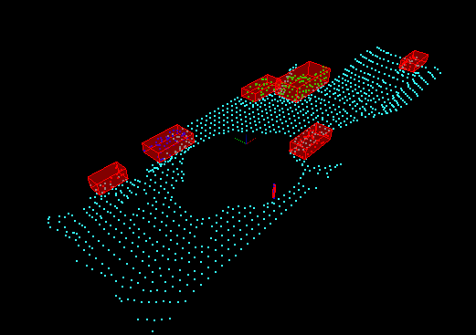

# Lidar obstacle detection project

This repo contains code to process Point Cloud Data from LIDAR sensing (pcd files).

From input pointclouds, the code:

  - Filters down the input pointcloud by reducing resolution and field of view (using pcl library).
  - Segments obstacles points from other points (floor/road) using RANSAC algorithm (Random Sample Consensus).
  - Clusters obstacles based on points distance, efficient neighbours research with KD-TREE algorithm (garanty balanced tree).
  - Draws Boxes around each detected clusters.

